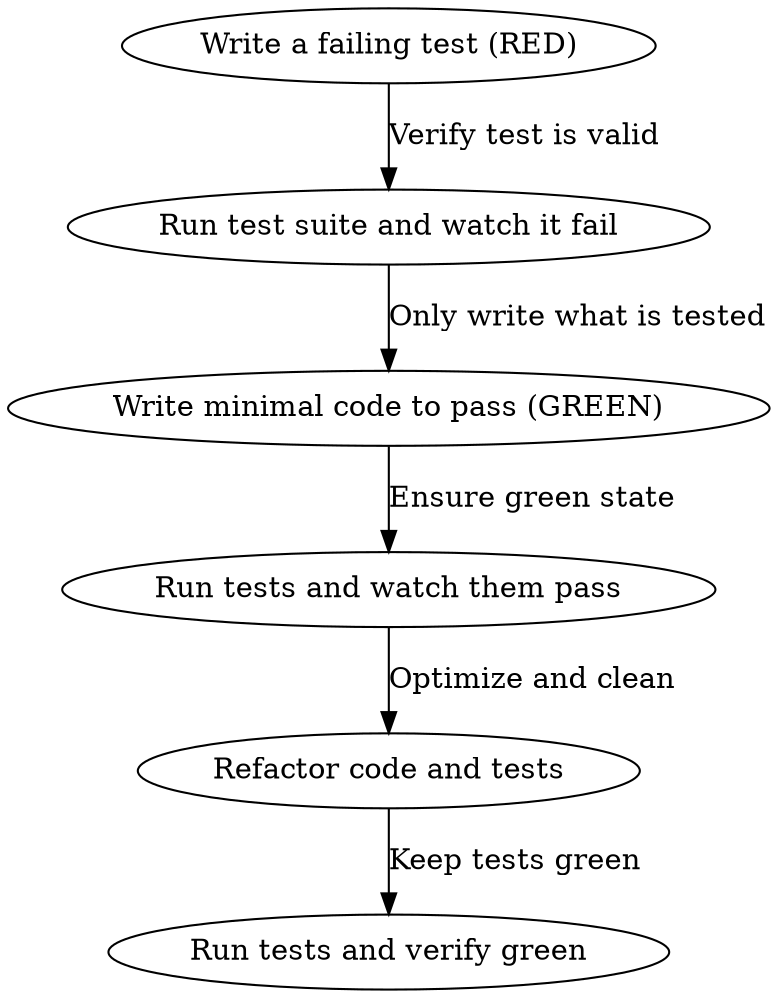

# API Unit & Integration Testing

A reusable, language-agnostic checklist to create, complete, and execute unit tests for a backend API or microservice. Follow the TDD (Red-Green-Refactor) pattern to guarantee test effectiveness.

All paths in this skill are relative to the **service repo root** (the project being tested).

## Prerequisites

Ensure you know the test commands and how to run coverage reports:
```bash
# JavaScript / Jest / Mocha
npm test
npm run test:cov

# Python / pytest
pytest
pytest --cov=src

# Go
go test -v ./...
go test -cover ./...
```

## Red Flags - STOP and Start Over

- Code written before tests
- "I'll test it manually first"
- "The coverage is good enough"
- "I can skip the failing test step because I know it will fail"
- "I'll just add tests for the happy path to meet coverage"

**All of these mean: Delete code. Start over with TDD.**

---

### 1. Test-Driven Development (TDD) Loop

**NO production code changes without a test verifying the change first.**



1. **RED:** Write a test that specifies the expected behavior. Run the test suite and verify it fails with the expected error. **Do not skip this step.**
2. **GREEN:** Write the minimal implementation code required to make the test pass. Do not add speculative code.
3. **REFACTOR:** Clean up the implementation and tests. Verify tests remain green.

---

### 2. Unit Testing Best Practices

#### 2.1 Focus on Isolation (Mocking)
Mock all external dependencies (databases, external HTTP calls, caches, message queues) to keep unit tests fast and independent.

```javascript
// Example Jest Mocking
jest.mock('../services/paymentGateway', () => ({
  chargeCard: jest.fn().mockResolvedValue({ success: true, transactionId: 'tx_123' })
}));
```

#### 2.2 Test Boundaries & Edge Cases
Ensure you test:
- **Happy Path:** Expected input returns expected output.
- **Bad Input:** Invalid schemas, null values, out-of-range bounds.
- **Error Conditions:** Database failures, timeout exceptions, validation rejections.
- **Boundary Conditions:** Empty arrays, maximum length values, off-by-one indices.

---

### 3. Unit Testing Checklist

#### Scope
- [ ] Target module/function for testing is clearly identified
- [ ] All external dependencies are mocked

#### TDD Compliance
- [ ] Test written *before* implementation code
- [ ] Test verified failing (RED) with the expected error message
- [ ] Implementation code is the minimal set to pass the test (GREEN)

#### Coverage & Quality
- [ ] Happy path is covered with assertions
- [ ] Edge cases (nulls, bounds, empty inputs) are covered
- [ ] Error conditions (exceptions, rejections) are covered
- [ ] No assertions are skipped or commented out
- [ ] No hardcoded assertions that bypass real logic

#### Verification
- [ ] Entire test suite runs and passes (0 failures)
- [ ] Test coverage meets project target (e.g., >80% statement coverage)
- [ ] No coverage regression compared to main branch

---

## Common Mistakes

| Rationalization | Reality |
|---|---|
| "The function is too simple to fail, I don't need a test." | Simple functions are often the source of off-by-one errors or null pointer exceptions. |
| "I'll write the test after I'm done coding." | Writing tests after coding leads to tests that mirror the code's bugs instead of specifying its contract. |
| "The tests pass, so I can skip the RED phase." | If the test passes before you change the code, your test is not actually testing your changes. |
| "Mocking is too hard, I'll just use the test database." | Database-dependent tests are slow, flaky, and are integration tests, not unit tests. |
